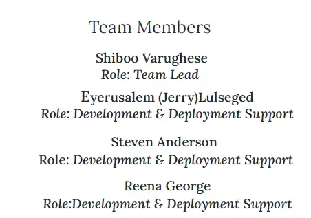

## Project Description

The Basic Laboratory Information System (BLIS), part of the C4G initiative, is a widely adopted open-source program in sub-Saharan Africa. Over ten nations in the region have embraced this system to manage patient information, laboratory specimens, and results. Before the implementation of BLIS, many of these countries relied on paper-based systems to track the spread of diseases, local illnesses, and other health-related data. With the advent of better information and communication technologies, the BLIS program has allowed these labs to standardize their reporting and effectively track the prevalence of infections, helping to slow their spread. The system was designed to be user-friendly, even for those with limited computing experience, and has already benefited over 1 million patients.
A system that can adapt to changing needs is crucial. The C4G BLIS, with its advanced user interface that can be customized to meet the specific requirements of various communities, can be a valuable resource. Its versatility enables it to be used across different platforms, making it a flexible solution for many people.

## Project Goals

1. Identify deployment production targets. 
2. Deploy BLIS V3.8 to the target client production accounts. 
3. Resolve any issues with the deployment. 
4. Smoke test production environment. 

## Lighthouse Scores

* Tested February 11th 2023
    * Performance - 97
    * Accessibility - 98
    * Best Practices - 92
    * SEO - 92
    * PWA - 89